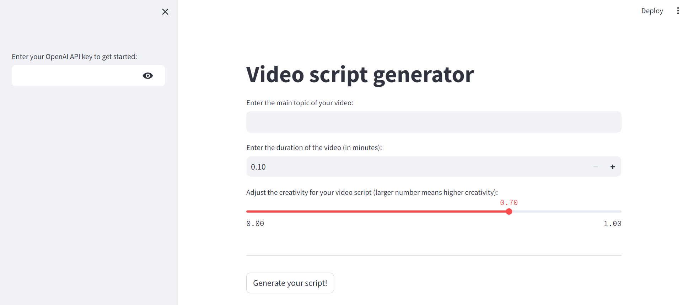

# AI-video-script-generator
Generates a video script based on the provided subject and duration by calling chat model API.

## Instructions
1. Enter your OpenAI API key to connect to their APIs.
2. Enter your video topic and video duration.
3. (Optional) Adjust how creative the AI model will be (larger number means higher creativity).
4. Click on "Generate your script!".
